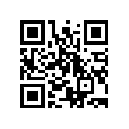

# 公众号文章 · 天赋星图发布稿

> 用途：发布到公众号「木焚心」（署名常作「枯木焚心」）  
> 调性：真诚、克制、略带文学感，反成功学，重过程  
> 配套：文末「阅读原文」放线上链接；封面图可用 poster-survey.html 截图或首页星图截图

---

## 标题（主推 + 备选）

**主推：**  
在不得不谋生的日子里，我替自己（也替你）做了一张"天赋星图"

**备选 A（反差感）：**  
一个不会写代码的统计学学生，和 AI 搭了个帮人找热爱的小站

**备选 B（痛点直击）：**  
25 岁了，我还不知道自己到底喜欢什么——直到我动手做了这个

**备选 C（情绪钩子）：**  
在最容易弄丢自己的年代，我替你留了一盏灯

---

## 摘要（公众号摘要字段，≤120 字）

---

## 正文

你有没有过那种时刻——

明明没在搬砖，却觉得被什么压着；刷了一晚上手机，关掉屏幕反而更空。

我们这代人，大多很早就学会了"怎么活下去"，却很少有人被认真问过一句：**你到底喜欢什么？**

我也是一个。学经济统计，Excel 半熟，Python 零基础，每天在"以后得找个安稳工作"的轨道上走着。偶尔半夜醒来，会愣一下：我热爱的东西，是什么来着？

先说清楚：这**不是**帮中学生选科、做升学规划的工具——那是另一码事。它是给已经在工作、却总说"不知道自己想干嘛"的成年人，在谋生的缝隙里，把热爱这件事重新认出来的。

后来我没等答案从天上掉下来，而是动手做了个网站：**天赋星图**。

它不测智商，不测你适不适合当领导，也**不搞星座血型那套**。它只做一件事——帮你在「兴趣 × 优势 × 心流」三层漏斗里，看见自己真正会被吸走注意力的那类事。

---

### 为什么信它？因为它踩的不是我的直觉

兴趣，用霍兰德 RIASEC 六型定位——就是那种"一旦出现，你手会先伸过去"的事；  
优势，用 VIA 24 项性格优势——你习以为常、别人却说"你天生就这般"的特质；  
心流，用契克森米哈赖的信号——你一做就忘记时间、做完像被充满的状态。

最后再加一层 **IKIGAI 现实校验**：热爱、擅长、世界需要、能谋生，四圈重合的那块，才是最稳的天赋区。

说清楚排除项：多元智能理论缺实证支撑，星座血型塔罗没有预测效度——这些我**一个都没放进去**。它不敢说"测出你的命"，它只是把你可能忽略的自己，摆到你眼前。

---

### 最常被人问的："你一个不会写代码的，怎么做出来？"

实话：我写不出。

但我有个数字搭子，叫**小羽**——一个 AI。我负责想清楚"要什么、给谁用、长什么样"，它负责把网页真正做出来。

我们在一晚上、几天里，把一个空白页迭代成六页闭环：

**首页 → 测评（约 8 分钟）→ 报告（你的星图）→ 行动（21 天心流日记）→ 案例墙 → 星图伙伴**

整站纯前端、零依赖、离线也能跑。没花一分钱，没装任何服务器。

这件事本身，就是我想说的另一半：**普通人和 AI 协作，真的能做出点东西。** 不是取代谁，是把自己那点想法放大。

---

### 我做它的理由，写在网站第一屏

> "在共产主义尚未到来的时期，人仍要为生存奔波、容易被异化劳动困住。我希望每个人依然能尽力发掘自己的爱好，把生命力放大到它应该在的水平。"

这句话有点重，但我舍不得改。因为它就是我——一个还在谋生的人——最想对另一个还在谋生的人，说的话。

---

### 你打开它，会发生什么

花 8 分钟测一下，你会拿到一张**属于你的星图**：哪几个兴趣最亮、哪 5 个优势在发光、心流常被什么点亮。

如果测完想聊聊"这结果准吗""我卡在执行上了"，还有个 **「星图伙伴」**——它读你刚测出的数据，专门接你的现状、卡点和怀疑。放心，它只存在你手机里，不收集你任何东西。

---

### 网站还很嫩，所以需要你

题库、文案、功能，都还粗糙。所以我把反馈通道开在公众号：

微信搜 **「木焚心」**，发 **「星图 / 反馈 / 建议」** 任意一个词，会触发自动回复引导你接着写——哪里别扭、哪题想选两个、想要什么功能，都行。想认真填，发 **「问卷」** 拿结构化模板，或长按识别下方二维码、直接点链接进问卷：https://v.wjx.cn/vm/QNK6V01.aspx#

**我每条都看。**

---

谢谢你读到这里。

这个站不是为了"成功"，是为了让更多像我们这样的人，在不得不谋生的缝隙里，还能认出自己那点光。

如果你也曾经不知道自己热爱什么，去测一张星图吧。然后回来告诉我——**你的星图，亮的是哪几颗。**

> 长按上图识别，或在微信搜「木焚心」发「问卷」拿同款链接。每张反馈，都会变成星图下一次亮起的光。

👇 点下方「阅读原文」，直接去画一张属于你的星图。  
觉得有用，点个「在看」，转给那个也总说"不知道自己想干嘛"的朋友。

—— 枯木，于一个普通的凌晨

---

## 发布配置清单（后台填）

- **标题**：选主推或备选其一
- **摘要**：用上方摘要字段
- **封面图**：建议用 `poster-survey.html` 浏览器截图（1080×1620 竖版星图风），或首页星图区域截图；封面比例选 2.35:1 大图或 1:1
- **阅读原文**：填线上链接 `https://46461dec3937411d970e0881cbfa0056.app.codebuddy.work`
- **自动回复（提前配好）**：关键词 `星图 / 反馈 / 建议` → 引导留言；关键词 `问卷` → 回问卷链接 https://v.wjx.cn/vm/QNK6V01.aspx#
- **留言/互动**：文末引导"回来告诉我你的星图亮哪几颗"，可在留言区置顶一条"晒星图"话题
